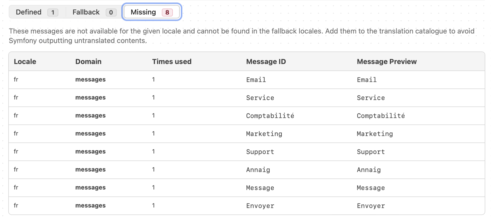

# Découvrir Symfony 7 (Grafikart)

[Playlist de tutoriels en libre accès](https://www.youtube.com/playlist?list=PLjwdMgw5TTLXuvlGqP18gbJCYVg7y6Fig) (les numéros des chapitres ci-dessous correspondent aux vidéos)

## Internationalisation

33min :

v v v v v v 7 8 9
1 2 3 4 5 6 7 8 9   = 18
1 2 3 4 5 6 7 8 9   = 27
1 2 3 4 5 6         = 33

Par défaut, le système va chercher des traductions pour les libellés.

### Traduction des libellés de formulaires

config/packages/translation.yaml pour piloter la traduction

- locale par défaut
- translator :

  - où sont les fichiers à utiliser (/translation),
  - le fallback,
  - les providers qui permettent d'utiliser des traductions automatiques.

créer les fichiers de traduction dans /translation

à nommer en fonction du domaine associé (cf. Profiler > translation: messages pour les libellés ici)

Par exemple, messages.fr.yaml (ou autre extension) = pour traduire en français

- directement le libellé (Prénom)
- ou sa variable défini dans le type (Email : label = contactForm.email, traduction 'courriel')

### Traduction de chaînes de caractères plus "arbitraires" (texte d'accueil...)

Solution 1 : utiliser le TAG "trans" dans templates/home/index.html.twig et ajouter la traduction dans translations/.

```twig
    Welcome Home!
````

Solution 2 : utiliser le FILTRE "trans" dans templates/home/index.html.twig et ajouter la traduction dans translations/.

```twig
    {{ 'Nice to see you.' | trans }}
````

Solution 3 : Injecter TranslatorInterface au niveau du contrôleur
