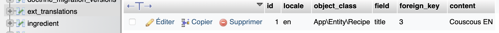

# Découvrir Symfony 7 (Grafikart)

[Playlist de tutoriels en libre accès](https://www.youtube.com/playlist?list=PLjwdMgw5TTLXuvlGqP18gbJCYVg7y6Fig) (les numéros des chapitres ci-dessous correspondent aux vidéos)

## Internationalisation

v v v    v v v      v v v   = 9 min

v v v    v v v      v v v   = 18 min

v v v   v v v   v v 27   = 27 min

28 29 30  31 32 33         = 33 min

[Documentation](https://symfony.com/doc/current/translation.html)

Par défaut, le système va chercher des traductions pour les libellés.

### Générer les traductions

#### Traduction des libellés de formulaires

config/packages/translation.yaml pour piloter la traduction

- locale par défaut
- translator :

  - où sont les fichiers à utiliser (/translation),
  - le fallback,
  - les providers qui permettent d'utiliser des traductions automatiques.

créer les fichiers de traduction dans translation/s

à nommer en fonction du domaine associé (cf. Profiler > translation: messages pour les libellés ici)

Par exemple, messages.fr.yaml (ou autre extension) = pour traduire en français

- directement le libellé (Prénom)
- ou sa variable défini dans le type (Email : label = contactForm.email, traduction 'courriel')

#### Traduction de chaînes de caractères plus "arbitraires" (texte d'accueil...)

Solution 1 : utiliser le TAG "trans" dans templates/home/index.html.twig et ajouter la traduction dans translations/.

```twig
    Welcome Home!
```

Solution 2 : utiliser le FILTRE "trans" dans templates/home/index.html.twig et ajouter la traduction dans translations/.

```twig
    {{ 'Nice to see you.' | trans }}
```

Solution 3 : Injecter TranslatorInterface au niveau du contrôleur
Puis utiliser la méthode trans('IDduMessage'). ---BUG ?!---

#### Générer les traductions de manière dynamique

```bash
php bin/console translation:extract --dump-messages fr
```

Il scanne tout le code source et génère toutes les clés de traductions (validation, etc.).
On peut lui demander de l'extraire dans un fichier yaml (sera prérempli par Symfony) :

```bash
php bin/console translation:extract --force fr --format=yaml
```

Crée un fichier par "domaine" : validators, security... mais n'a pas été capable de scanner les formulaires car ce sont de simples chaînes de caractères.`

On peut y remédier en utilisant la fonction Symfony globale t() dans les libellés de formulaires : cela crée un objet TranslatableMessage qui sera reconnu et extrait dans les yaml :

```php
'label' => t('contactForm.submit')
```

Il est recommandé d'utiliser cette fonction. Néanmoins elle a des bugs dans les version de Symfony 7.0 et 7.1, cela devrait sans doute être résolu dans la future version stable 7.4

#### Fichier intl-icu

cf. [Documentation Sf/icu](https://symfony.com/doc/current/reference/formats/message_format.html)

Généré par la commande ci-dessus parfois, permet de gérer un format supplémentaire :

- Traduction du singulier et du pluriel si j'ai un nombre variable.
- Traduction des genres

Dans le template :

```twig
{{ "home_recipe_count" | trans({count : 100}) }}
````

Dans le fichier intl-icu :

```php
home_recipe_count: >-
  {count, plural,
    =0    {Aucune recette}
    =1    {Une recette}
    other {# recettes}
  }
```

- cas où je veux mettre une info supplémentaire (ici le nom) :

Dans le template :

```twig
{{ 'Nice to see you' | trans({name: 'Jane'}) }}
````

Dans le fichier "normal" des traductions :

```php
'Nice to see you ': 'ça fait plaiz, name'
```

### Paramétrer le changement de langue

#### 1er cas : changer en fonction d'une information utilisateur

Ajouter la propriété $locale à l'entité User :

- la définir à 'fr' par défaut
- ajouter une option pour que 'fr' par défaut soit en bdd aussi

Utiliser le service LocaleSwitcher :

- choisir à quel moment; ici : lorsque la requête rentre
- créer le UserLocaleListener, rattaché à kernel.request
- le customiser avec un constructeur injectant le composant Security & LocaleSwitcher (du composant Translation)
- dans onKernelRequest(), récupérer l'utilisateur avec Security
- ...et changer la locale de l'utilisateur avec setLocale() de LocaleSwitcher

#### 2e cas : approche par url

Préfixer l'url par /fr/ et sinon que la page d'accueil soit en anglais.

Symfony dispose d'un système pour faire cela automatiquement, en local ou en global :

Localement (préfixer chaque route) :

Dans les contrôleurs, à chaque url, ajouter la locale en paramètre :

```php
#[Route("/{_locale}", name: "home")]
```

Globalement (Préfixer toutes les routes de tous les contrôleurs) :

Dans config/routes.yaml :

```yaml
controllers:
    prefix: "{_locale}"
    requirements:
        _locale: en|fr|de
```

### Comment se passe la traduction en bdd ?

1e approche, la plus simple : 1 site pour chaque langue. On a alors 2 bdd et les configurations du .env qui varient d'un site à l'autre.

2e approche : une bdd avec des chaînes de traduction. S'il y a des contenus communs et qu'on les veut traduire d'une langue à l'autre.

On peut tout faire soi-même ... ou utiliser Doctrine Extension Bundle qui permet d'ajouter plein de fonctionnalités à Doctrine : Sluggable (gérer des slugs automatiquement), TimeStampable (gérer dates création et modif dynamiquement), Translatable...

- [Documentation de Symfony](https://symfony.com/bundles/StofDoctrineExtensionsBundle/current/index.html)
- [Documentation de Doctrine Extensions](https://github.com/doctrine-extensions/DoctrineExtensions)
- [Documentation de StofDoctrineExtensionBundle](https://github.com/stof/StofDoctrineExtensionsBundle), qui permet de préinstaller DoctrineExtension et d'ajouter les configurations et les listeners automatiquement directement dans Symfony.

Installation :

```bash
composer require stof/doctrine-extensions-bundle
```

Configuration : cf. [Documentation](https://symfony.com/bundles/StofDoctrineExtensionsBundle/current/configuration.html)

- "Add the extensions to your mapping" : copier la partie "translatable" et l'ajouter dans doctrine.yaml (orm > mappings) = "voilà comment chercher les éléments qui ont le préfixe "Gedmo\Translatable\Entity".

- "Activate the extensions you want" : dans stof_doctrine_extensions.yaml, ajouter translatable à true.

Utilisation :

- dans les entités, ajouter un attribut #[Translatable] aux champs qu'on veut traduire.
- pour gérer les traductions, il faut une table séparée : elle est créée en faisant une migration
  
  ```php
  $this->addSql('CREATE TABLE ext_translations (id INT AUTO_INCREMENT NOT NULL, locale VARCHAR(8) NOT NULL, ...);
  ```

  Elle comprend l'ensemble des traductions correspondant à nos modèles.
  

  La version française, correspondant à la locale par défaut, est sauvegardée au niveau de l'entité.
